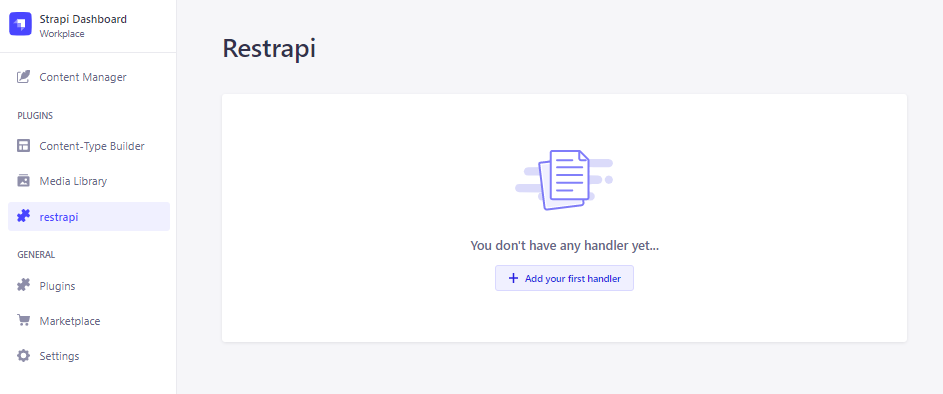

# Strapi plugin restrapi

A quick description of restrapi.

# Setup

Note: currently only available for strapi v4

### Install strapi v4

```
npx create-strapi-app@latest my-project --quickstart
```

### 1. Install strapi v4

```sql
npx create-strapi-app@latest my-project --quickstart
```

Lebih lengkapnya dapat dilihat melalui [dokumentasi strapi](https://docs.strapi.io/developer-docs/latest/getting-started/quick-start.html).

### 2. Install plugin restrapi

```sql
cd my-project
yarn add restrapi
```

### 3. Setup config

Ubah config plugin di `config/plugins.js` — atau buat file jika belum ada.

```jsx
// config/plugins.js

module.exports = {
  restrapi: {
    enabled: true,
  },
};
```

Build dan jalankan strapi dengan command

```jsx
yarn build
yarn develop
```

Strapi akan melakukan build dan mengambil plugin dari `node_modules`

### 4. Membuat entity

Entity dapat dibuat melalui menu Content Type Builder


Pada contoh ini, ada 2 collection yang dibuat: Invoices dan Orders


Isikan beberapa contoh data

### 5. Membuat Handler

- Masuk ke menu restrapi > `Add your first handler`
  
- Pada contoh ini akan dibuat Rest API untuk mendapatkan data order berdasarkan order_id - nya, dengan cara mengisi data berikut
  
  - Method : GET
  - Path : getorderbyorderid
  - Script :
    ```sql
    SELECT * FROM orders
    LEFT JOIN invoices ON orders.order_id = invoices.order_id
    WHERE orders.order_id = '::order_id::'
    ```
  - Klik Add Params
    - Name : order_id
    - Data Type : STRING
    - Klik REQUIRED
- Klik Submit

### 6. Eksekusi handler

Untuk mengeksekusi script dapat menggunakan Postman / Insomnia / sejenisnya dengan cara melakukan request dengan format `<host>/restrapi/api/public/:path?<param_name>=<param_value>`, atau dalam contoh ini:

```
curl --request GET \
  --url 'http://localhost:1337/restrapi/api/public/getorderbyorderid?order_id=tst_01'
```


